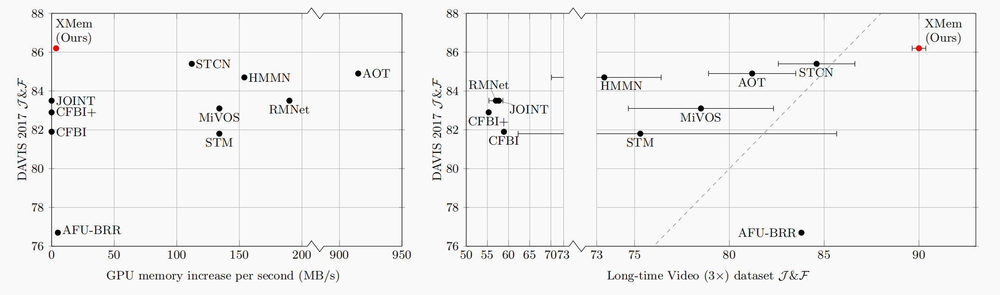
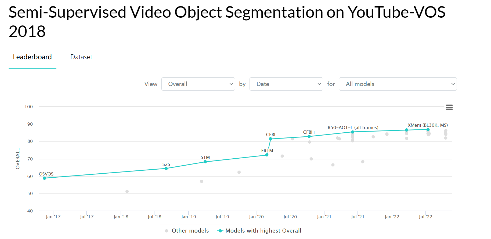
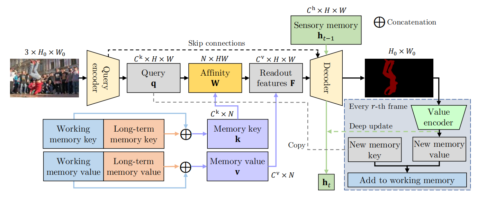
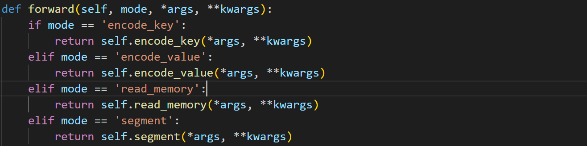

# video object segmentation：XMem model

Student name: 张力宇，张骥霄，郑博方

Student ID：12012530

## **1. Introduction**

Video object segmentation is a traditional direction in CV. There is some important formal knowledge that you should know, otherwise you maybe not know what it is coming. If we say the procedure of VOS, we always has first frame ground truth. Because there are many objects in a video, you need to specify which objects need to track and segment. Although the ground truth can also get by CLIP language model, in this report, we talk about traditional semi-supervised VOS that you must have a ground truth in the  first frame.

I think the challenge in this field is the improvement of both accuracy rate, FPS, and the requirement of the GPU.  Especially for the requirement of GPU, because the video store already consumes much memory, we need to propose a simple and effective model which can run on consumer GPUs like RTX3060 not only on the a100 in the laboratory.  For the accuracy rate, I think it's hard for the model to predict the object with the camera in other directions which the object may appear differently in different directions. 


## **2. Related works**

  

<center>
    Figure: The Current performance of VOS models[1]
</center>
The above figure is referred from XMem paper[1]. We can find that XMem increases GPU memory use with lower speed and get a higher score in Long-time video.

For our group to narrate the related works, we can't read all the papers in the field of VOS in such a short time. We mostly focus on two series of models STM and AOT.  AOT series of models mostly use the continuous hidden state to cope with the prediction of masks. STM series of models just use the attention block to measure the similarity of queres(current pictures) and keys(ground truth annotation picture). STM series of models will put the output of previous frames into the attention pool. 

We will briefly introduce the progress of STM series of models. STCN is the second improved model of STM. Its primary improvement concentrate on the key encoder for multiobject segmentation. For each video frame, STCN only generates one key for this picture, generating different values for the objects. And STCN abandons the usage of the previous frame output as the memory key.



We can see the leaderboard in paperswithcode, In recent months, the best 2 models are the AOT series(R50-AOT-L) and the STM series(XMem). And the SOTA is the XMem.

## **3. Method**



<center>
    Figure: The procedure of XMem[1]
</center>



The XMem model integrates four critical models. We will introduce their design patterns following the sequence of picture.

### 3.1 encode key

As long as the pictures comes into the model, the pictures mask are sent into encode key submodel. **The pictures will process in the encode key model for only once.** Because this key won't change until the next batch after backpropagation. **The frame shape is [batch, the number of  frames of each instance(8 in gerneral), 3(RGB channel), 384,384 ].** The key_encoder is classic resnet 50 and f16 is the width and height of the picture shrink 16 times. The f4 and  the f8 is similar.  **The key shape is [batch,the number of  frames of each instance,channel of key, 24,24]** It's also notable that you need first to combine the first and seconde dimension because pytorch only can handle batch dimension. The shrinkage and selection is computed for the similarity of key and query which is a new computation method for attention not the dot method. The key, shrinkage and selection are all got by CNN and other projection function like sigmoid.

```python
# The code is simplifed by us
def encode_key(self, frame, need_sk=True, need_ek=True): 
        frame = frame.flatten(start_dim=0, end_dim=1)
        f16, f8, f4 = self.key_encoder(frame)
        key, shrinkage, selection = self.key_proj(f16, need_sk, need_ek)
        return key, shrinkage, selection, f16, f8, f4
class KeyEncoder(nn.Module):
    def __init__(self):
        super().__init__()
        network = resnet.resnet50(pretrained=True)
        self.conv1 = network.conv1
        self.bn1 = network.bn1
        self.relu = network.relu  # 1/2, 64
        self.maxpool = network.maxpool

        self.res2 = network.layer1 # 1/4, 256
        self.layer2 = network.layer2 # 1/8, 512
        self.layer3 = network.layer3 # 1/16, 1024
class KeyProjection(nn.Module):
    def __init__(self, in_dim, keydim):
        super().__init__()

        self.key_proj = nn.Conv2d(in_dim, keydim, kernel_size=3, padding=1)
        # shrinkage
        self.d_proj = nn.Conv2d(in_dim, 1, kernel_size=3, padding=1)
        # selection
        self.e_proj = nn.Conv2d(in_dim, keydim, kernel_size=3, padding=1)

        nn.init.orthogonal_(self.key_proj.weight.data)
        nn.init.zeros_(self.key_proj.bias.data)
    
    def forward(self, x, need_s, need_e):
        shrinkage = self.d_proj(x)**2 + 1 if (need_s) else None  # 对应论文第10页
        selection = torch.sigmoid(self.e_proj(x)) if (need_e) else None

        return self.key_proj(x), shrinkage, selection
```

### 3.4 segment


## Reference

[1]

```
@inproceedings{cheng2022xmem,
  title={{XMem}: Long-Term Video Object Segmentation with an Atkinson-Shiffrin Memory Model},
  author={Cheng, Ho Kei and Alexander G. Schwing},
  booktitle={ECCV},
  year={2022}
}
```